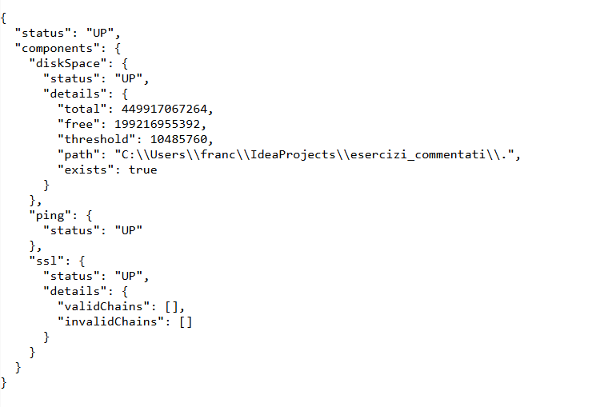

# ATTUATORI
In questo esercizio si propone un esempio d'uso degli attuatori. 
In Spring gli attuatori sono degli strumenti di monitoraggio del servizio implementato: forniscono vari endpoint (documentati qui) che aiutano nel monitoraggio e, fino a un certo punto, nella gestione della nostra applicazione.

Vengono inseriti tramite una dipendenza maven:

```
<dependency>
    <groupId>org.springframework.boot</groupId>
    <artifactId>spring-boot-starter-actuator</artifactId>
</dependency>
```

Dato che sono inseriti tramite dipendenza la loro porta di default in cui sono disponibili è la 8080. Spring offre una serie di attuatori che possiamo rendere disponibili andando a specificarli nel file application.yml
```yml
management:
  endpoints:
  web:
    exposure:
      include: "*"
  endpoint:
    health:
      show-details: ALWAYS
    env:
      post:
        enabled: true
```

In questo caso ci sono due endpoint _health_ e _env_: 
- L’endpoint /actuator/health fornisce una panoramica dello stato di salute dell’applicazione.
  - In questo caso 
  - 
- L'endpoint /actuator/env ritorna le proprietà dell'ambiente corrente in cui gira il servizio.