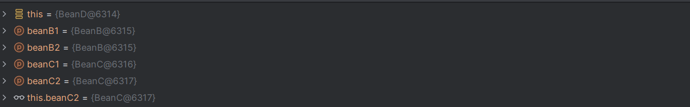

# BEANS
In questo esercizio si affronta il concetto di Scope dei bean. 
Un bean è un oggetto che è stato istanziato, configurato e gestito dal contenitore di inversione del controllo (IoC) di Spring. Essenzialmente, un bean è un'istanza di una classe che è stata definita nella configurazione di Spring e può essere utilizzata all'interno dell'applicazione.
Ci sono due scope dei bean: **singleton e prototype** che definiscono come i bean vengono creati e gestiti nel contenitore Spring.
- Singleton: è lo scope di default. Spring crea solo un’istanza di un bean per contenitore Spring. Questa istanza è condivisa tra tutte le parti dell’applicazione che richiedono il bean. Il bean viene creato quando il contenitore Spring è inizializzato (inizializzazione avido per impostazione predefinita) e resta in memoria per tutta la durata del ciclo di vita del contenitore.
- Prototype: viene creata una nuova istanza del bean ogni volta che viene richiesta dal contenitore Spring. A differenza di singleton, il ciclo di vita di un bean prototype è di breve durata 

Nella cartella src.main.java.com.nbicocchi troviamo due cartelle: 
1. beans: definisce 4 bean: A,B,C bean indipendenti; D, bean con le dipendenze di B E C.
2. config: in questo caso si specifica l'ambito dei Bean (@Scope): di default è singleton 
 - BeanB: Annotato con @Scope("singleton"), significa che Spring creerà solo una sola istanza di BeanB e la utilizzerà per tutte le richieste di questo bean. Questo è utile quando si desidera condividere lo stato tra diverse parti dell'applicazione.
 - BeanC: Annotato con @Scope("prototype"), significa che ogni volta che BeanC viene richiesto, verrà creata una nuova istanza. Questo è utile quando si desidera che ciascun oggetto abbia il proprio stato e comportamento unici.

b1 e b2 sono in effetti riferimenti allo stesso oggetto mentre c1 e c2 sono riferimenti a oggetti diversi

