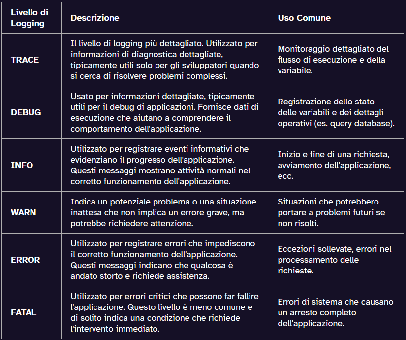

# LOGS
In questo esercizio si esegue un meccanismo di logging tramite Lombok e le annotazioni @Log4j2 in modo che i veri metodi invocati dal controller vengano loggati0. 
Il livello di logging è specificato nel file _application.yml_ e  filtra i messaggi in base al livello di log configurato: 



```
server:
port: 7000

logging:
level:
root: WARN
org.springframework: INFO
com.nbicocchi: DEBUG
```


```
package com.nbicocchi;
import lombok.extern.log4j.Log4j2;
import org.slf4j.Logger;
import org.slf4j.LoggerFactory;
import org.springframework.web.bind.annotation.*;

import java.time.LocalDate;
import java.time.LocalTime;

@Log4j2
@RestController
public class DateTimeController {
@GetMapping("/time")
public String getTime() {
String response = LocalTime.now().toString();
log.info("getTime() invoked, returning {}", response);
return response;
}

    @GetMapping("/date")
    public String getDate() {
        String response = LocalDate.now().toString();
        log.info("getDate() invoked, returning {}", response);
        return response;
    }
}
```